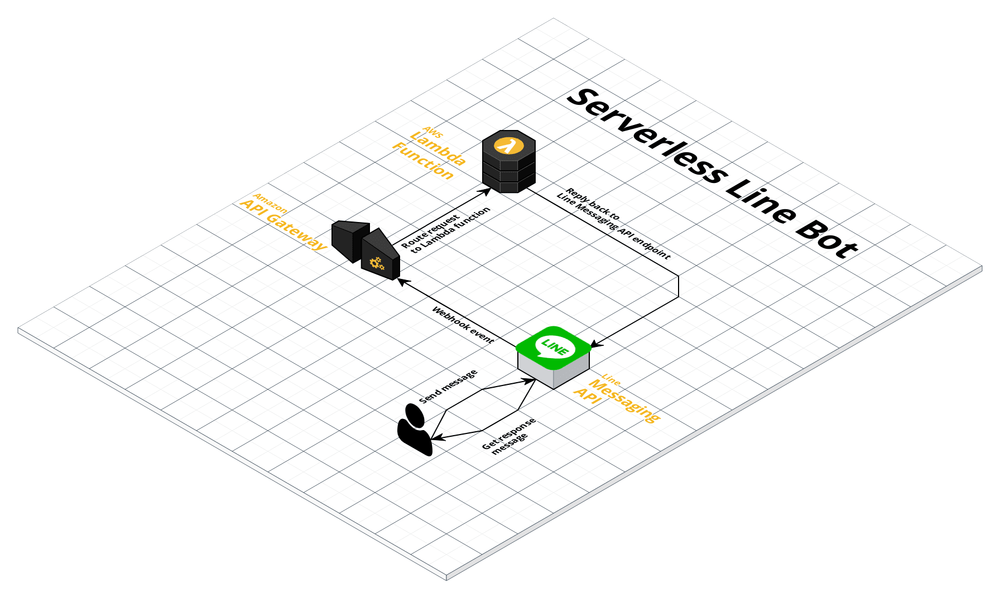

## Terraform 101!

> "Infrastructure as code as it should"

---

* managing infra used to be all manual, on bricks
<!-- .element: class="fragment" data-fragment-index="1"-->
* some pattern emerged => automation
<!-- .element: class="fragment" data-fragment-index="2"-->
* enter cloud, shit just got more complicated
<!-- .element: class="fragment" data-fragment-index="3"-->

---

> a simple web application

---

### We need something...

* declarative
<!-- .element: class="fragment" data-fragment-index="1"-->
* reproducible
<!-- .element: class="fragment" data-fragment-index="2"-->
* idempotent
<!-- .element: class="fragment" data-fragment-index="3"-->
---

### We need

---

### Terraform

* has all the properties mentioned above
<!-- .element: class="fragment" data-fragment-index="1"-->
* support many providers
<!-- .element: class="fragment" data-fragment-index="2"-->
* has module, we can build some abstraction here
<!-- .element: class="fragment" data-fragment-index="3"-->

---

### Time to code!

---

Let's build _a Serverless_ Line bot

---

### Let's dig in
 
* provider
<!-- .element: class="fragment" data-fragment-index="1"-->
* resource
<!-- .element: class="fragment" data-fragment-index="2"-->
* data
<!-- .element: class="fragment" data-fragment-index="3"-->
---

### Misc

* fmt
<!-- .element: class="fragment" data-fragment-index="1"-->
* graph
<!-- .element: class="fragment" data-fragment-index="2"-->

---

> Let's look at the graph

---

It might look simple but don't forget permissions!

---

# Demo time!

---

### Something else worth mentioning

* variable
<!-- .element: class="fragment" data-fragment-index="1"-->
* locals
<!-- .element: class="fragment" data-fragment-index="2"-->
* output
<!-- .element: class="fragment" data-fragment-index="3"-->

---

> we can create different environment using variables!

---

> THE END

